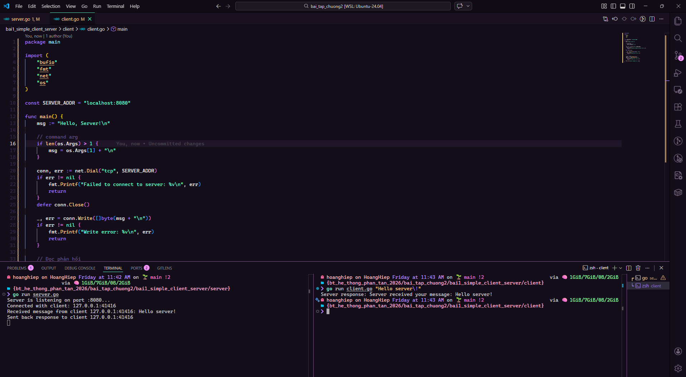

## Bài tập 1: Xây dựng mô hình Client-Server đơn giản

Viết một chương trình mô phỏng mô hình Client-Server với các yêu cầu sau:

- Server: Chạy trên một cổng cố định và lắng nghe các yêu cầu từ client.
- Client: Kết nối đến server, gửi một thông điệp và nhận phản hồi từ server.

Gợi ý: Dùng thư viện socket, có thể dùng ngôn ngữ C#, Python, Java

## Bài 2:
