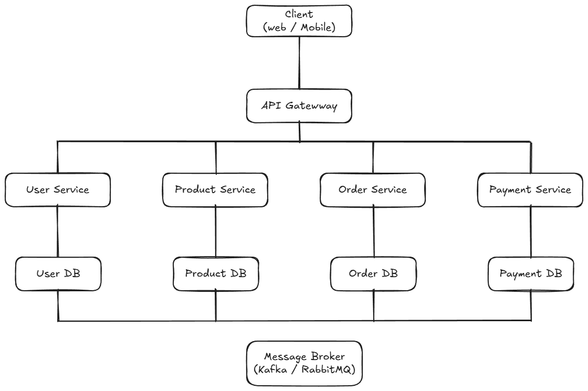
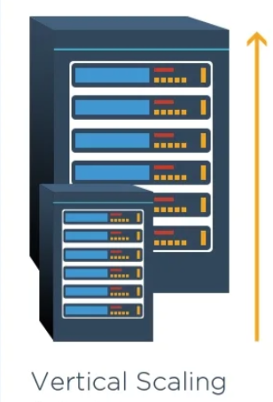
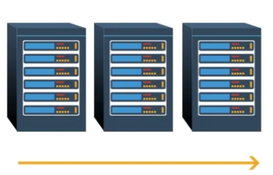
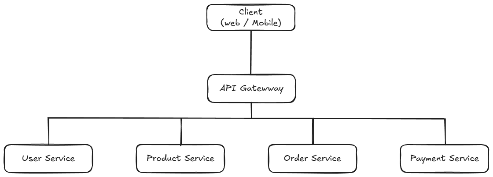
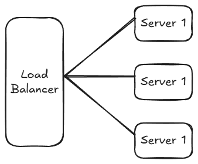

# Kiến trúc chung của hệ thống

Các thành phần quan trọng:

1. Client (Web / Mobile)
2. API Gateway
3. Các Microservices
4. Message Broker
5. Databases riêng cho từng service
   

# 1. Cách các dịch vụ giao tiếp với nhau

Trong kiến trúc Microservices, các dịch vụ có thể giao tiếp theo **hai cách chính**:

## a. Giao tiếp đồng bộ (Synchronous Communication)

Sử dụng:

- REST API
- HTTP/HTTPS
- gRPC

Ví dụ: Khi người dùng thực hiện đặt hàng, **Order Service** cần kiểm tra thông tin người dùng.
Để thực hiện điều này, Order Service sẽ gửi một HTTP request tới **User Service** để lấy thông tin tài khoản của người dùng.

```
Order Service ----HTTP Request----> User Service
```

Ví dụ:

```
GET /users/{id}
GET /products/{id}
```

### Ưu điểm

- Dễ triển khai và dễ hiểu
- Thời gian phản hồi nhanh vì nhận kết quả ngay lập tức
- Phù hợp với các request đơn giản

### Nhược điểm

- Service phụ thuộc trực tiếp vào nhau
- Nếu một service bị lỗi có thể ảnh hưởng service khác

## b. Giao tiếp bất đồng bộ (Asynchronous Communication)

Sử dụng **Message Queue / Event Streaming -** **Publish-Subscribe Architecture**

Ví dụ:

- Kafka
- RabbitMQ
- NATS

### Ví dụ quy trình đặt hàng

1. User đặt hàng
2. Order Service tạo order
3. Order Service publish event:

```
OrderCreated
```

4. Payment Service nhận event
5. Payment Service xử lý thanh toán

```
Order Service ---> Message Broker ---> Payment Service
```

### Ưu điểm

- Loose coupling
- Hệ thống chịu lỗi tốt hơn
- Dễ mở rộng

# 2. Lưu trữ và đồng bộ dữ liệu

## a. Lưu trữ

Trong kiến trúc Microservices, **mỗi service có database riêng**.

| Service         | Database   |
| --------------- | ---------- |
| User Service    | User DB    |
| Product Service | Product DB |
| Order Service   | Order DB   |
| Payment Service | Payment DB |

### Lý do

- Tránh phụ thuộc dữ liệu
- Service có thể phát triển độc lập
- Dễ mở rộng

## b. Đồng bộ dữ liệu giữa các service

Có hai cách phổ biến:

### 1. Event-driven architecture

Service publish event khi dữ liệu thay đổi.

Ví dụ:

```
ProductUpdated
UserCreated
OrderCompleted
```

Luồng dữ liệu:

```
Product Service
      |
      v
Publish Event: ProductUpdated
      |
      v
Message Broker
      |
      v
Order Service / Search Service
```

Điều này giúp các service đồng bộ dữ liệu một cách **eventual consistency**.

### 2. API call

Service có thể gọi trực tiếp API của service khác để lấy dữ liệu.

Ví dụ:

```
Order Service -> Product Service
```

# 3. Khả năng mở rộng của hệ thống

Microservices có thể mở rộng theo nhiều cách.

## a. Vertical Scaling

Tăng sức mạnh của server (Ram, CPU, ...)



## b. Horizontal Scaling

Thay vì tăng sức mạnh một server, ta **tăng số lượng instance** của service.

Load balancer sẽ phân phối request.



## c. API Gateway

Trong kiến trúc Microservices, client **không gọi trực tiếp từng service**, mà thông qua **API Gateway**.

### Vai trò của API Gateway

API Gateway là **điểm vào duy nhất của hệ thống**.



API Gateway có thể thực hiện:

- Routing request tới service phù hợp
- Authentication / Authorization
- Rate limiting
- Logging
- Load balancing

### Ví dụ

```
GET /api/users/1
```

API Gateway sẽ route request tới:

```
User Service
```

### Lợi ích

- Giảm độ phức tạp cho client
- Ẩn kiến trúc bên trong hệ thống
- Quản lý request tập trung

# d. Load Balancer

Khi hệ thống có nhiều người dùng, một service có thể chạy **nhiều instance**.

**Load Balancer** sẽ phân phối request tới các instance này.



### Lợi ích

- Tránh quá tải một server
- Tăng khả năng chịu tải
- Tăng độ sẵn sàng của hệ thống

# e. Khả năng chịu lỗi (Fault Tolerance)

Trong hệ thống phân tán, một service có thể **bị lỗi hoặc tạm thời không hoạt động**.

Một số cách giúp hệ thống vẫn hoạt động:

### Retry

Nếu request thất bại, service có thể thử lại.

### Message Queue buffering

Trong kiến trúc **asynchronous**, message broker sẽ giữ message nếu service chưa xử lý được.

```
Order Service --> Message Queue --> Payment Service (xử lý sau)
```

Điều này giúp hệ thống **không bị mất dữ liệu khi service tạm thời bị lỗi**.
