## Bài 1:

### a. Tính tổng của 1 triệu số bằng cách chia nhỏ danh sách và chạy trên nhiều tiến trìn

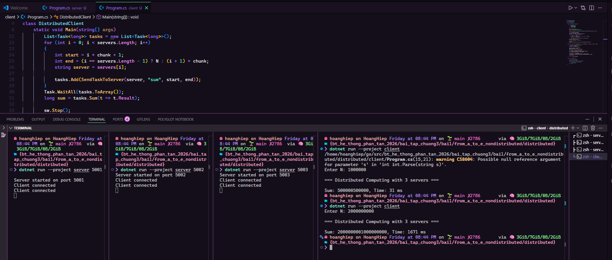

### b. Cho phép người dùng chọn số tiến trình chạy song song.

### c. Áp dụng tính tổng các số nguyên tố trong khoảng lớn.

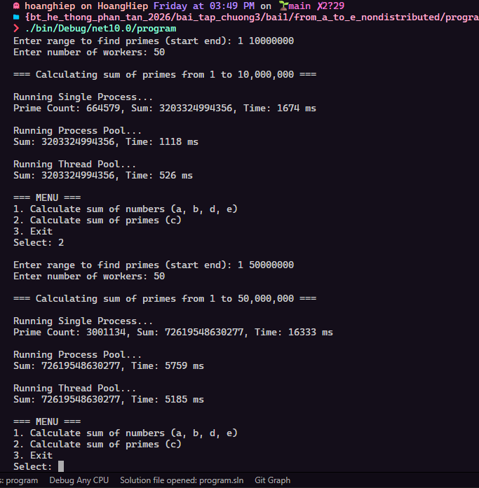

### d. Thử nghiệm với bộ dữ liệu lớn và đo thời gian thực thi.

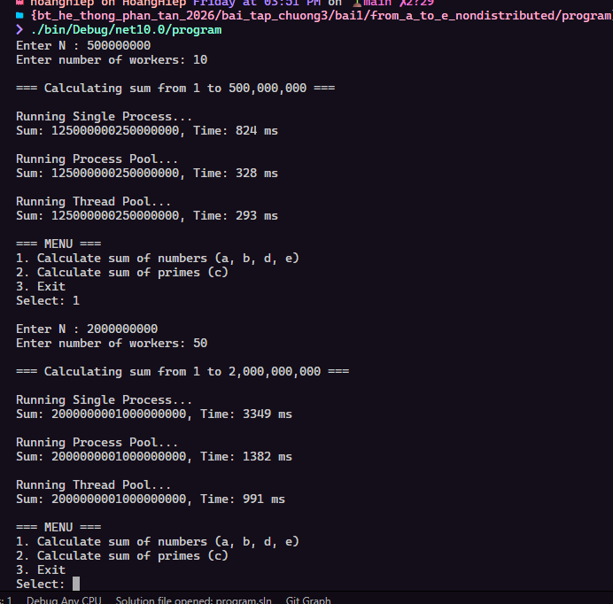

### e. So sánh giữa Process Pool và Thread Pool để thấy sự khác biệt. <đã chạy từ câu trên, nên ảnh giống nhau>

### f. Chạy trên hệ thống phân tán thật sự: Chia nhỏ dữ liệu và gửi cho nhiều máy khác nhau xử lý.

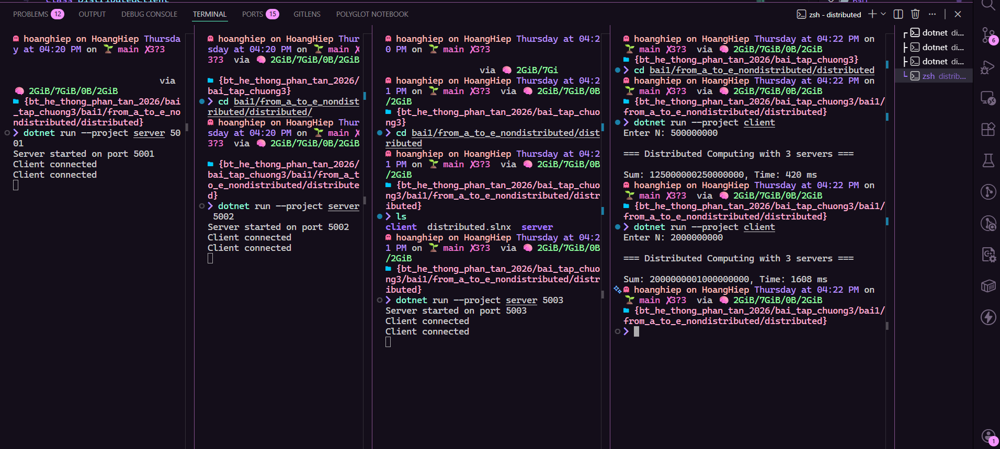

## Bài 2:

### a. Tạo 2 tiến trình (Process A và Process B). Mỗi tiến trình giữ một tài nguyên (Resource 1, Resource 2) và chờ tài nguyên còn lại. Nếu cả hai tiến trình đều giữ tài nguyên của mình và chờ vô hạn tài nguyên của tiến trình kia → xảy ra Deadlock. Dùng timeout để thoát khỏi deadlock nếu chờ quá lâu.

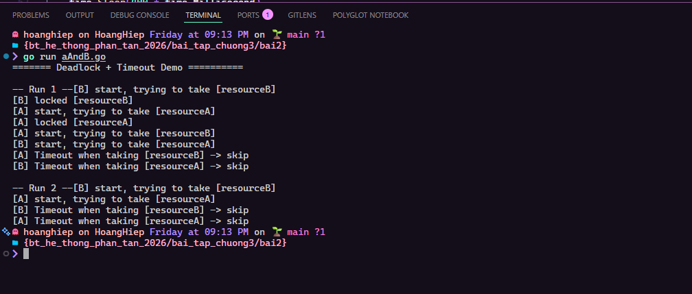

### b. Kiểm tra nếu có deadlock thì hủy bỏ tiến trình hoặc giải phóng tài nguyên.

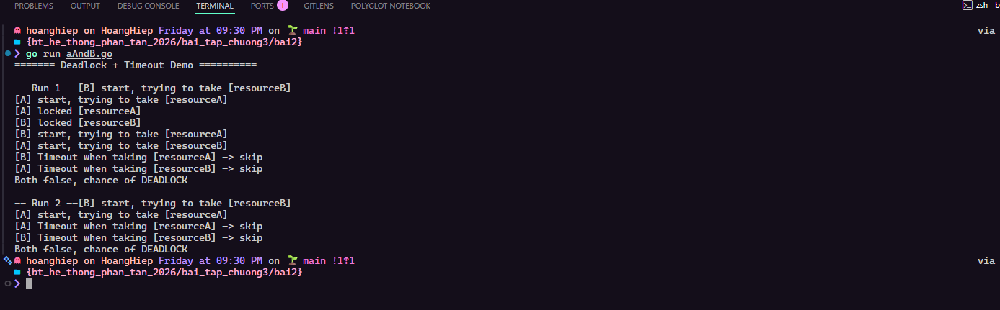

### c. Thêm nhiều tiến trình và nhiều tài nguyên hơn để kiểm tra tình trạng deadlock phức tạp hơn.

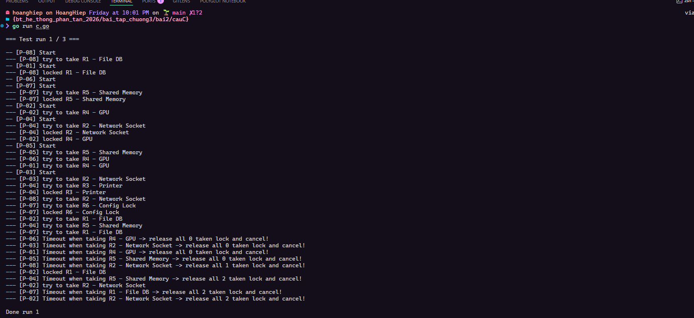

### d. Sử dụng Banker’s Algorithm để phát hiện trước deadlock và ngăn chặn.

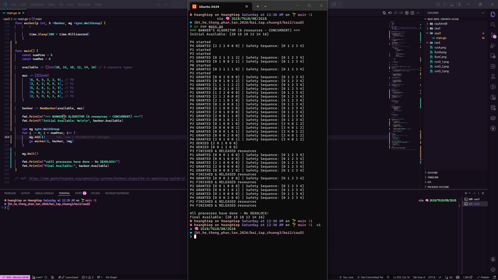

### e. Dùng mutex hoặc semaphore để quản lý tài nguyên tốt hơn.

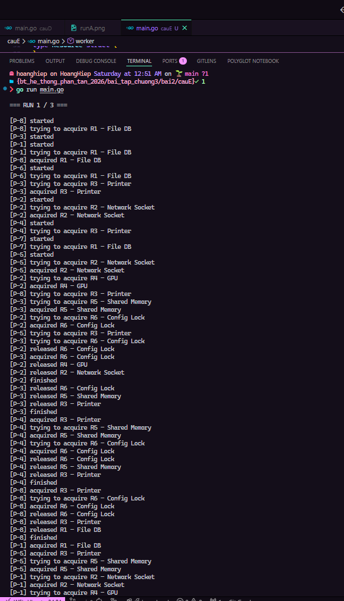
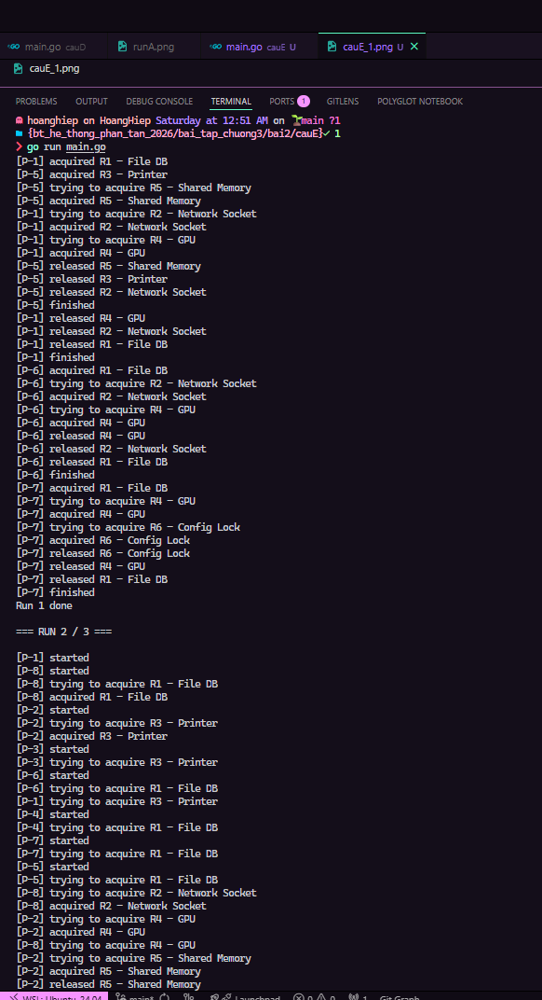

## Bài 3:

### a.

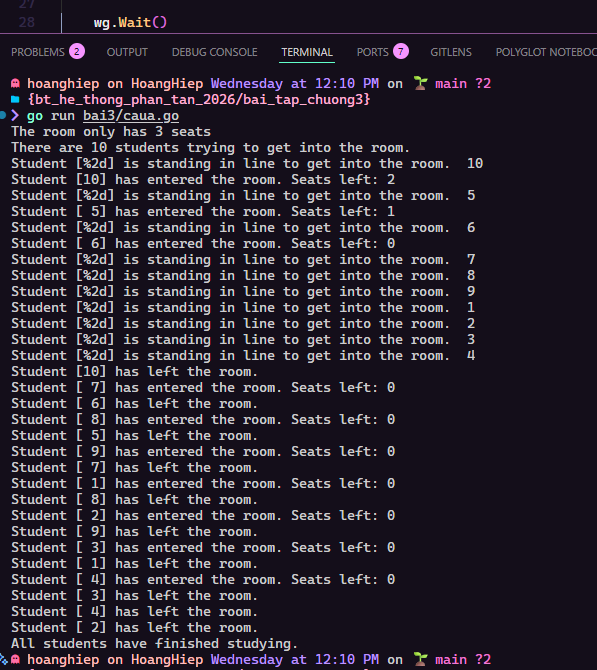

### b.

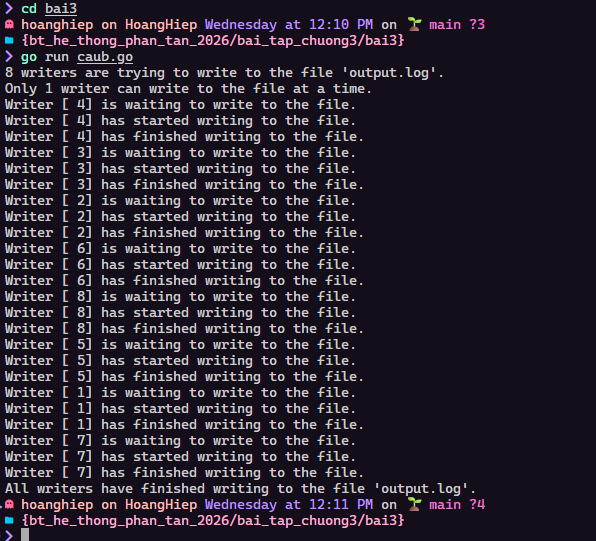

## Bài 4:

### a.

### b.

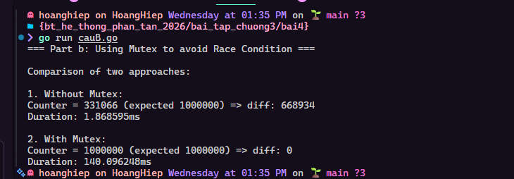

### c.

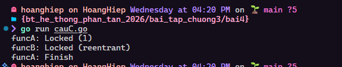

## Bài 5:

### a.

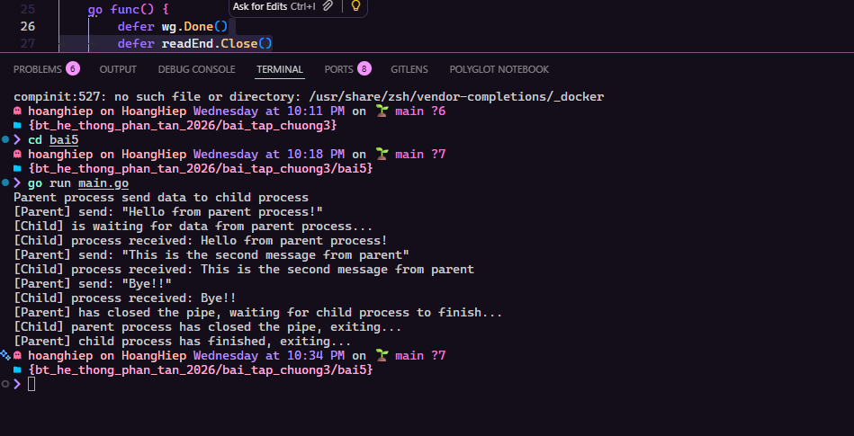

### b.

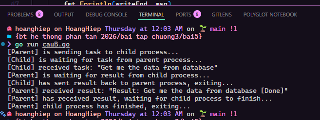

### c.

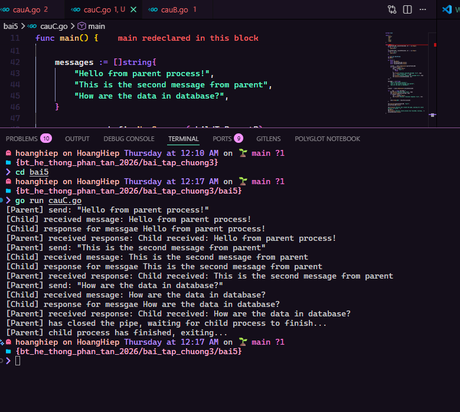

### d.

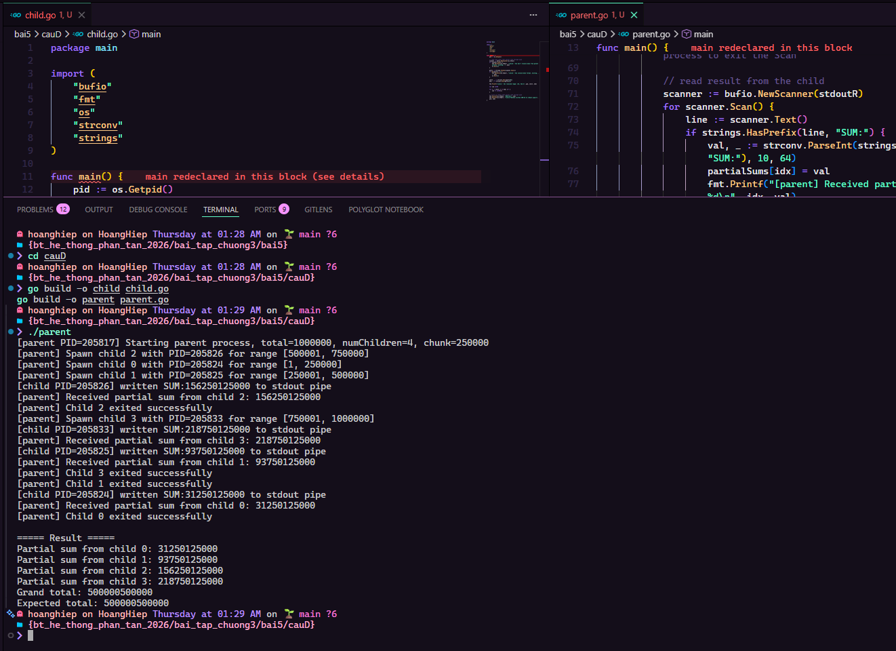
