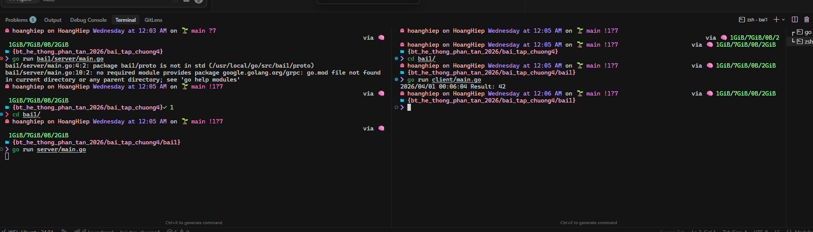
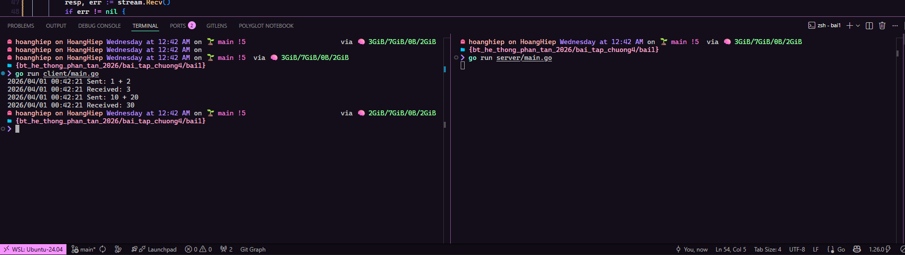
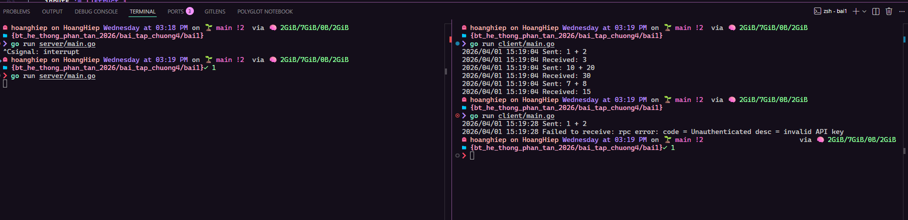
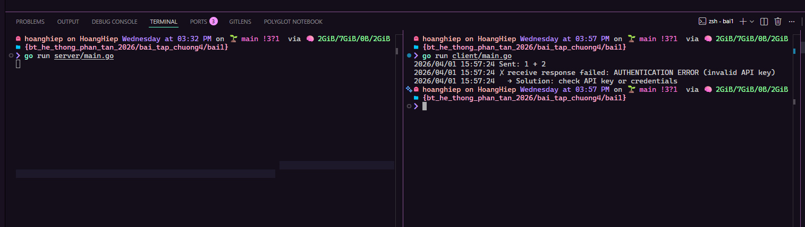
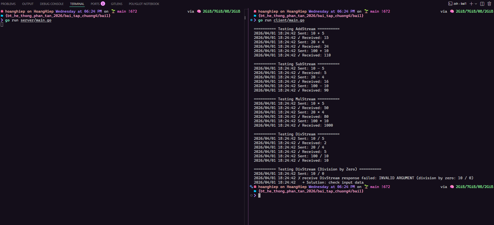
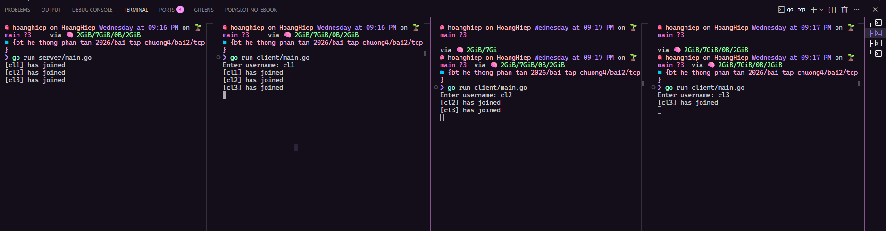
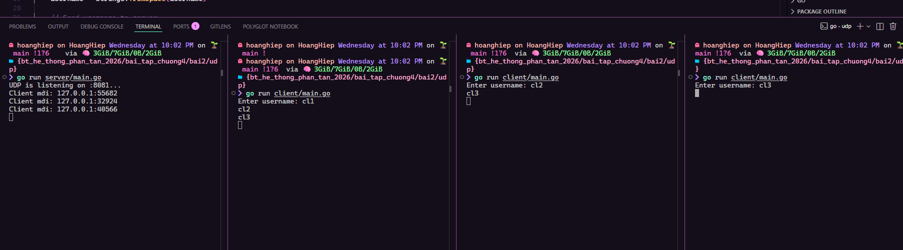

# I. Phần lý thuyết

## Bai 1: So sánh các mô hình giao tiếp

| Mô hình                           | Đặc điểm chính                                                                                              | Ưu điểm                                                                                               | Nhược điểm                                                                                                           | Tình huống nên sử dụng                                                                     |
| --------------------------------- | ----------------------------------------------------------------------------------------------------------- | ----------------------------------------------------------------------------------------------------- | -------------------------------------------------------------------------------------------------------------------- | ------------------------------------------------------------------------------------------ |
| **Remote Procedure Call (RPC)**   | Gọi thủ tục từ xa như gọi cục bộ (stub/skeleton, parameter marshalling). Thường synchronous.                | Dễ lập trình, che giấu sự phân tán, trừu tượng cao (gần giống gọi hàm local).                         | Synchronous dễ gây deadlock, overhead marshalling lớn, khó xử lý failure, không phù hợp với giao tiếp không đồng bộ. | Microservices cần gọi hàm đồng bộ, tính toán ngắn, truy vấn database.                      |
| **Message Passing**               | Gửi/nhận tin nhắn (send/receive). Có transient (socket) và persistent (message queue). Hỗ trợ asynchronous. | Decoupling mạnh (sender và receiver không cần biết nhau), scalable, hỗ trợ asynchronous & persistent. | Phức tạp hơn (phải tự xử lý ordering, reliability, duplicate), abstraction thấp hơn RPC.                             | Hệ thống cần loose coupling, task queue, logging, xử lý sự kiện dài hạn (RabbitMQ, Kafka). |
| **Stream-Oriented Communication** | Truyền dữ liệu liên tục (continuous data flow) với yêu cầu về timing (thường dùng UDP/TCP cho multimedia).  | Hiệu suất cao cho dữ liệu lớn & real-time, hỗ trợ streaming (Server/Client/Bidirectional).            | Không đảm bảo reliability nếu dùng UDP, rất nhạy cảm với delay, jitter, packet loss, khó xử lý ordering.             | Truyền dữ liệu real-time: video call, sensor stream, audio/video broadcasting.             |

## Baì 1:

### _a. Client gửi yêu cầu tính tổng hai số nguyên đến Server. Server nhận yêu cầu, tính toán kết quả và trả về cho Client. Giao tiếp giữa Client và Server phải được thực hiện thông qua_

### _b. So sánh gRPC với REST API_

#### Bảng so sánh chi tiết

| Tiêu chí                     | gRPC (dựa trên RPC)                                                                                                           | REST API                                                | Ưu điểm của gRPC so với REST                                |
| ---------------------------- | ----------------------------------------------------------------------------------------------------------------------------- | ------------------------------------------------------- | ----------------------------------------------------------- |
| **Mô hình giao tiếp**        | Procedure-oriented (gọi hàm từ xa như gọi cục bộ) – hỗ trợ Unary, Server Streaming, Client Streaming, Bidirectional Streaming | Resource-oriented (CRUD trên resource qua HTTP methods) | Trừu tượng cao hơn, dễ lập trình, hỗ trợ streaming tự nhiên |
| **Giao thức truyền tải**     | HTTP/2 (multiplexing, header compression, server push)                                                                        | Thường HTTP/1.1 (mỗi request một connection)            | Hiệu suất cao hơn, latency thấp, multiplexing mạnh          |
| **Định dạng dữ liệu**        | Protocol Buffers (binary, strongly typed)                                                                                     | JSON (text-based)                                       | Payload nhỏ hơn, marshalling nhanh, giảm overhead mạng      |
| **Hiệu suất & Bandwidth**    | Rất cao (binary + HTTP/2)                                                                                                     | Thấp hơn (JSON + HTTP/1.1)                              | Giảm đáng kể độ trễ và băng thông                           |
| **Streaming**                | Hỗ trợ native (Server/Client/Bidirectional)                                                                                   | Không hỗ trợ native (phải poll hoặc WebSocket)          | Dễ dàng triển khai Stream-Oriented Communication            |
| **Error handling & Timeout** | Built-in status codes, deadlines, cancellation                                                                                | Phải tự implement (HTTP status codes)                   | Xử lý lỗi và timeout tốt hơn                                |
| **Bảo mật**                  | TLS mặc định + authentication tích hợp                                                                                        | Phải cấu hình riêng (HTTPS)                             | Dễ bật TLS và authentication                                |
| **Contract / Schema**        | Protobuf (compile-time checking)                                                                                              | OpenAPI/Swagger (runtime checking)                      | Type-safe mạnh, ít lỗi runtime                              |

#### gRPC có ưu điểm gì so với REST trong hệ thống phân tán?

- **Hiệu suất cao hơn rõ rệt**: Binary serialization + HTTP/2 giúp giảm kích thước dữ liệu và latency → phù hợp với nguyên tắc **scalability** và **dependability** .
- **Hỗ trợ streaming native**: Giải quyết trực tiếp nhu cầu của Stream-Oriented Communication.
- **Strong typing & contract rõ ràng**: Giảm lỗi khi truyền tham số.
- **Built-in features**: Compression, deadline/timeout, cancellation, load balancing → che giấu sự phân tán tốt hơn.
- **Phù hợp internal microservices**: Dùng giữa các service trong hệ thống, không cần browser compatibility.

#### Khi nào nên sử dụng gRPC thay vì REST?

- Khi hệ thống **cần hiệu suất cao và latency thấp** (microservices nội bộ, high-throughput).
- Khi cần **streaming dữ liệu real-time** (sensor data, video, chat, monitoring).
- Khi các service **cùng ngôn ngữ/tech stack** và muốn type-safe mạnh.
- Khi muốn **giảm overhead mạng** (payload nhỏ, multiplexing).
- Khi triển khai trên Kubernetes (dễ load balancing với gRPC).

**Nên dùng REST** khi:

- API công khai (public API) cần hỗ trợ browser/web client.
- Cần compatibility rộng (mobile, third-party).
- Ưu tiên readability và debugging dễ (JSON dễ đọc).

### _c. Tối ưu hóa hiệu suất RPC_
- Add Bidirectional Streaming:


### _d. Bảo mật trong gRPC_

Bật TLS:

- Server: `credentials.NewServerTLSFromFile("server.crt", "server.key")`
- Client: `credentials.NewClientTLSFromFile("ca.crt", "localhost")`

Authentication:

- Client gửi API key qua metadata: `metadata.Pairs("x-api-key", "...")`
- Server dùng stream interceptor `(grpc.StreamInterceptor)` kiểm tra key trước khi cho phép RPC chạy
- Sai/thiếu key → trả `codes.Unauthenticated`

### _e. Xử lý lỗi trong gRPC_


**Xử lý lỗi trong gRPC:**

1. **Phân loại lỗi theo status code** (`codes.DeadlineExceeded`, `Unauthenticated`, `Unavailable`, `Internal`, etc.)
2. **Client nên**:
   - Kiểm tra `status.FromError(err)` để lấy chi tiết lỗi
   - Xử lý từng loại lỗi riêng (retry cho `Unavailable`, báo user cho `Unauthenticated`, log cho `Internal`)
   - Không dùng `log.Fatalf` trực tiếp → graceful degradation

**Deadline/Timeout:**

- Dùng `context.WithTimeout(ctx, duration)` để đảm bảo client không chờ vô hạn
- Server tự động hủy xử lý khi context deadline vượt quá
- Best practice: set timeout hợp lý (3-5s cho unary, 30s-1m cho stream dài)

**Retry logic** (nâng cao):
- Dùng `grpc.WithDefaultCallOptions(grpc.WaitForReady(true))` để tự động retry khi server unavailable
- Hoặc tự implement exponential backoff cho các lỗi tạm thời

### _f. Triển khai Server gRPC trên Kubernetes_

#### Các bước triển khai Server gRPC trên Kubernetes:

1. **Đóng gói ứng dụng**:
   - Tạo `Dockerfile` để build image chứa server gRPC
   - Push image lên container registry (Docker Hub, GCR, ECR...)

2. **Tạo Kubernetes Deployment**:
   - Định nghĩa số replica (ví dụ 3 pods) để đảm bảo high availability
   - Mount TLS certificates qua ConfigMap hoặc Secret
   - Cấu hình resource limits (CPU, memory)
   - Thêm health checks (liveness/readiness probe) bằng `grpc_health_probe`

3. **Tạo Kubernetes Service**:
   - Expose Deployment qua Service (ClusterIP cho internal, LoadBalancer cho external)
   - Cấu hình port 50052 cho gRPC

4. **Quản lý cấu hình**:
   - Dùng ConfigMap cho cấu hình không nhạy cảm
   - Dùng Secret cho TLS certs và API keys
   - Dùng Environment variables để inject config vào pods

#### Load Balancing cho gRPC trên Kubernetes:

**Vấn đề đặc biệt:**
- gRPC sử dụng **HTTP/2** với **long-lived connections** (persistent stream)
- Kubernetes Service mặc định load balance ở **Layer 4 (TCP)** → chỉ balance khi mở connection mới
- Kết quả: tất cả request trên cùng 1 stream đều đi vào 1 pod → **không cân bằng tải hiệu quả**

**Các giải pháp:**

| Giải pháp | Cách hoạt động | Ưu điểm | Nhược điểm | Khi nào dùng |
|-----------|---------------|---------|------------|--------------|
| **Client-side Load Balancing** | Client dùng Headless Service để resolve tất cả pod IPs, tự balance theo `round_robin` | Đơn giản, hiệu suất cao, không cần thêm infrastructure | Client phải hỗ trợ (gRPC built-in), phức tạp hơn cho client | Internal microservices, client có thể control code |
| **Service Mesh (Istio/Linkerd)** | Inject sidecar proxy vào mỗi pod, proxy xử lý L7 load balancing tự động | Tự động, hỗ trợ mTLS/retry/observability, không cần sửa code | Overhead cao (thêm proxy), phức tạp setup | Production với nhiều services, cần observability |
| **Envoy Proxy** | Deploy Envoy như standalone proxy giữa client và server | L7 load balancing mạnh, config linh hoạt | Thêm 1 hop network, cần maintain thêm component | Khi không muốn dùng full service mesh |
| **External Load Balancer** | Dùng cloud LB hỗ trợ gRPC (GCP LB, AWS ALB) | Managed service, dễ setup | Chỉ cho external traffic, phụ thuộc cloud provider | Expose gRPC ra internet |

**Khuyến nghị:**
- **Internal microservices**: Client-side LB (Headless Service + `dns:///` resolver)
- **Production phức tạp**: Service Mesh (Istio) để có đầy đủ tính năng security + observability
- **Đơn giản nhất**: Chấp nhận L4 load balancing + thiết kế client reconnect định kỳ

**Ví dụ Headless Service cho client-side LB:**
```yaml
apiVersion: v1
kind: Service
metadata:
  name: grpc-calculator-headless
spec:
  clusterIP: None  # Headless - trả về tất cả pod IPs
  selector:
    app: grpc-calculator
  ports:
  - port: 50052
```

Client code:
```go
conn, err := grpc.NewClient(
    "dns:///grpc-calculator-headless.default.svc.cluster.local:50052",
    grpc.WithDefaultServiceConfig(`{"loadBalancingPolicy":"round_robin"}`),
)
```

### _g. Bổ sung phương thức Multiply, Subtract, Divide để mở rộng tính năng tính toán._


## Bài 2:
### a. 

### b. 
