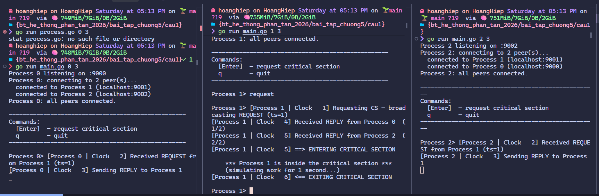
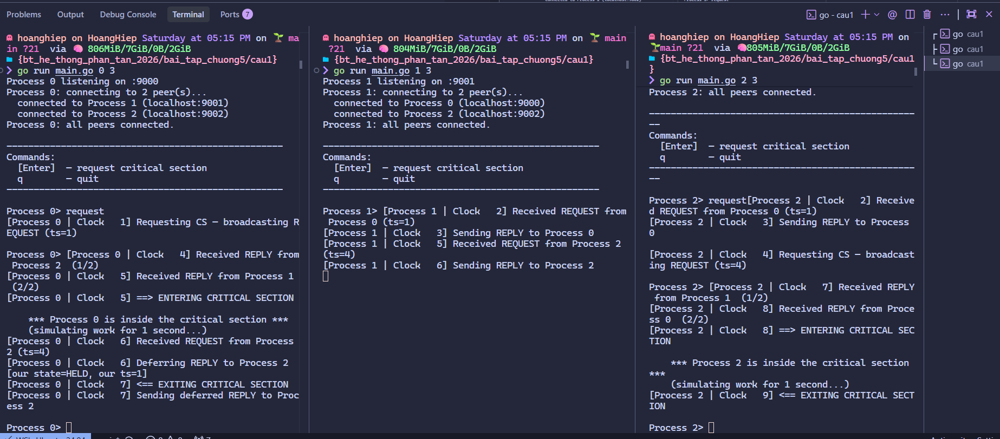
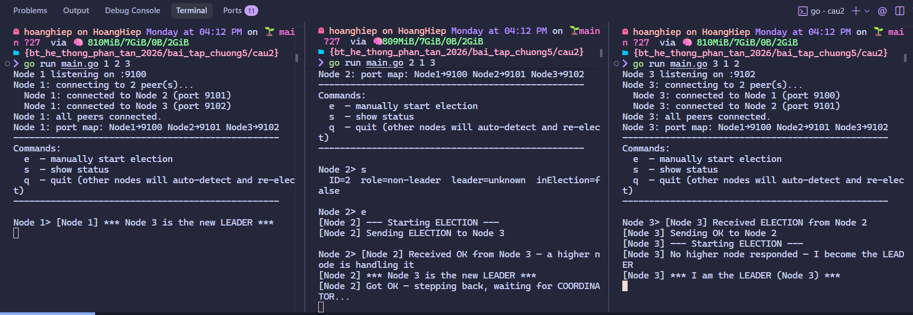
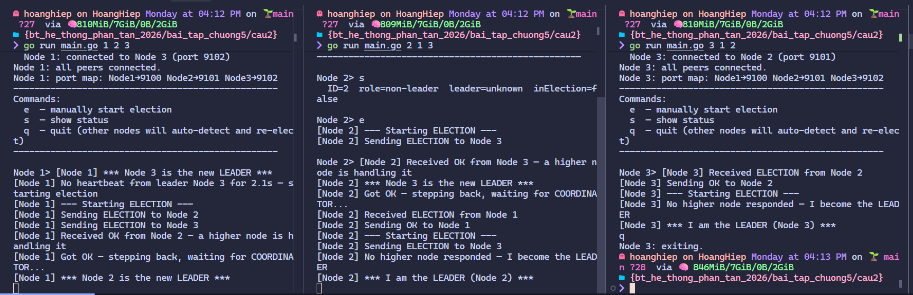
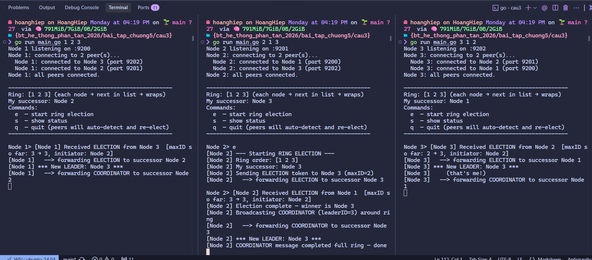
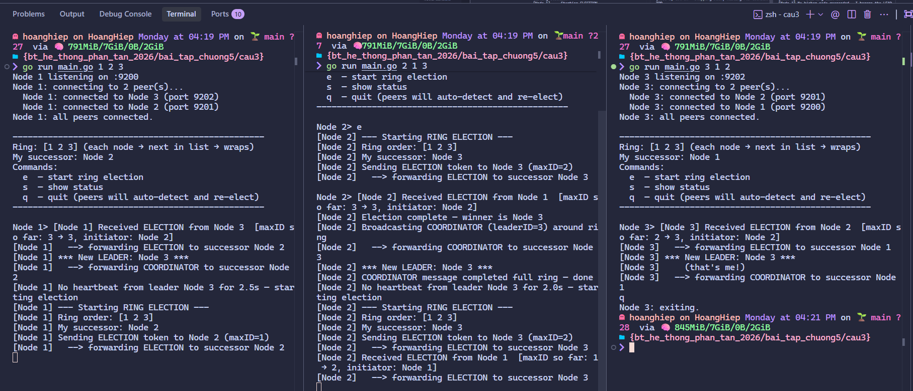
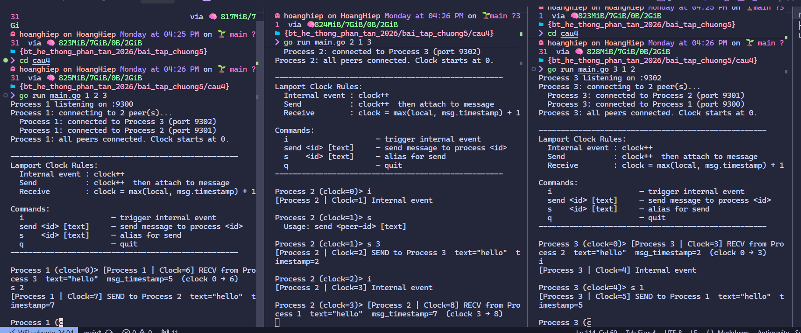
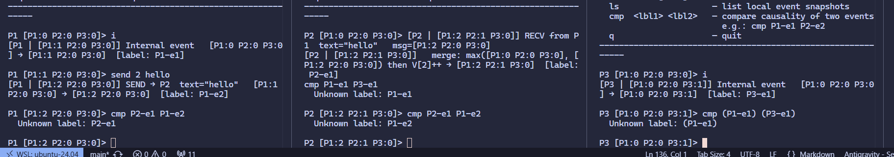
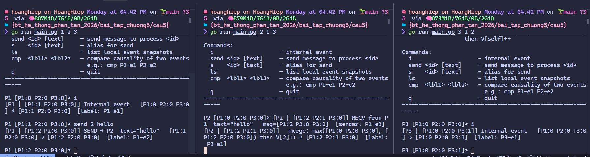
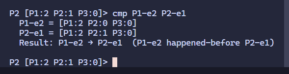

# I. Câu hỏi lý thuyết

## 1. Mutual Exclusion (Loại trừ tương hỗ)

### - Loại trừ tương hỗ trong hệ phân tán là gì? Tại sao nó quan trọng?

**Định nghĩa:**  
Loại trừ tương hỗ (Mutual Exclusion - ME) trong hệ phân tán là một tính chất đảm bảo rằng **chỉ một tiến trình (process) duy nhất** được phép truy cập vào **phần tử quan trọng (Critical Section - CS)** tại bất kỳ thời điểm nào. Các tiến trình giao tiếp với nhau chỉ qua trao đổi tin nhắn (message passing), không có bộ nhớ chung.

**Tầm quan trọng:**  
- Ngăn chặn **race condition** và dữ liệu bị hỏng (data inconsistency).  
- Đảm bảo tính toàn vẹn dữ liệu khi truy cập tài nguyên chia sẻ (shared resources) như file, máy in, cơ sở dữ liệu, biến toàn cục.  
- Tránh các lỗi nghiêm trọng như deadlock, starvation hoặc kết quả tính toán sai trong các ứng dụng phân tán (ví dụ: hệ thống ngân hàng, đặt vé máy bay, quản lý tài nguyên mạng).

Nếu không có ME, nhiều tiến trình có thể cùng sửa đổi tài nguyên → dẫn đến kết quả không nhất quán và hệ thống không đáng tin cậy.

### - So sánh các thuật toán loại trừ tương hỗ

| Thuật toán                  | Cách hoạt động chính                          | Số tin nhắn trung bình (per CS entry) | Ưu điểm                                                                 | Nhược điểm                                                                 |
|-----------------------------|-----------------------------------------------|----------------------------------------|--------------------------------------------------------------------------|-----------------------------------------------------------------------------|
| **Dựa trên token** (Token Ring) | Token duy nhất luân chuyển theo vòng (ring). Tiến trình chỉ vào CS khi cầm token. | O(1) đến O(N) (tùy vị trí token)     | - Đơn giản - Overhead thấp khi tải cao - Không cần timestamp     | - Token mất → cần cơ chế phục hồi - Latency cao nếu vòng lớn - Single point of failure nếu token bị kẹt |
| **Dựa trên message passing** (Ricart-Agrawala) | Mỗi tiến trình gửi REQUEST có timestamp đến **tất cả** các tiến trình khác, chờ REPLY. Sử dụng timestamp + ID để quyết định thứ tự. | 2(N-1)                                | - Không có điểm yếu trung tâm - Công bằng (fair) - Không cần token | - Overhead tin nhắn cao (O(N)) - Khó mở rộng với N lớn - Phải gửi tin nhắn broadcast |
| **Dựa trên server tập trung** (Centralized) | Có một coordinator duy nhất. Tiến trình gửi REQUEST → nhận GRANT → vào CS → gửi RELEASE. | 3                                     | - Rất đơn giản - Ít tin nhắn nhất - Dễ triển khai                 | - **Single point of failure** (coordinator hỏng → toàn bộ hệ thống chết) - Bottleneck khi tải cao - Không scalable |

**Tóm tắt so sánh:**
- **Token-based**: phù hợp hệ thống tải cao, vòng ổn định.
- **Ricart-Agrawala**: phù hợp khi cần tính công bằng cao và không muốn điểm yếu trung tâm.
- **Centralized**: tốt cho hệ thống nhỏ, yêu cầu đơn giản nhưng rủi ro cao nhất về độ tin cậy.

## 2. Election Algorithms (Thuật toán bầu cử)

### - Mô tả thuật toán Bully trong bầu cử leader và nêu các bước chính

**Thuật toán Bully** (thuật toán “đại ca”):  
Dựa trên **ID** của các tiến trình (process ID càng lớn càng ưu tiên). Tiến trình có ID cao nhất sẽ trở thành **leader (coordinator)**.

**Các bước chính:**

1. **Phát hiện cần bầu cử**: Một tiến trình Pi phát hiện coordinator hiện tại bị hỏng (không phản hồi timeout).
2. **Gửi Election**: Pi gửi thông điệp **Election** đến **tất cả** tiến trình có ID lớn hơn mình.
3. **Nhận phản hồi**:
   - Nếu có bất kỳ tiến trình Pj (ID > Pi) trả lời **OK** → Pi dừng bầu cử và chờ thông báo coordinator mới.
   - Nếu **không có phản hồi** từ ai (timeout) → Pi tự tuyên bố mình là coordinator mới.
4. **Thông báo thắng cử**: Pi gửi thông điệp **Coordinator** đến tất cả các tiến trình khác.
5. **Kết thúc**: Tất cả tiến trình cập nhật coordinator mới và tiếp tục hoạt động.

**Đặc điểm:**  
- Số tin nhắn worst-case: O(N²).  
- Phù hợp hệ thống mà ID có thứ tự rõ ràng.

### - Thuật toán Ring Election hoạt động như thế nào?

**Thuật toán Ring Election**:  
Các tiến trình được tổ chức thành **một vòng logic (logical ring)** (mỗi tiến trình biết successor của mình).

**Cách hoạt động:**

1. **Khởi tạo**: Khi Pi phát hiện coordinator hỏng, Pi tạo thông điệp **Election** chứa ID của mình và gửi cho successor.
2. **Truyền vòng**: Mỗi tiến trình nhận Election:
   - Nếu ID của mình **lớn hơn** ID trong thông điệp → thay ID trong thông điệp bằng ID của mình.
   - Nếu ID của mình **nhỏ hơn** → giữ nguyên ID trong thông điệp.
   - Gửi tiếp thông điệp cho successor.
3. **Vòng quay về**: Khi thông điệp quay về Pi (người khởi tạo):
   - ID lớn nhất trong thông điệp chính là leader.
   - Pi gửi thông điệp **Coordinator** (chứa ID leader) đi một vòng nữa để thông báo cho tất cả.
4. **Kết thúc**: Tất cả tiến trình biết leader mới.

**Đặc điểm:**  
- Số tin nhắn: 2N (một vòng Election + một vòng Coordinator).  
- Đơn giản, dễ triển khai.

### - So sánh thuật toán Bully và thuật toán Ring Election. Thuật toán nào hiệu quả hơn?

| Tiêu chí              | Bully Algorithm                          | Ring Election                              | Thuật toán nào tốt hơn? |
|-----------------------|------------------------------------------|--------------------------------------------|--------------------------|
| **Số tin nhắn**      | O(N²) (worst-case)                       | O(2N)                                      | **Ring** tốt hơn        |
| **Thời gian bầu cử** | Nhanh (tiến trình ID cao thắng ngay)     | Chậm hơn (phải chờ vòng đầy đủ)            | Bully nhanh hơn         |
| **Yêu cầu cấu trúc** | Không cần ring, chỉ cần biết tất cả ID   | Phải có logical ring (mỗi node biết successor) | Bully linh hoạt hơn     |
| **Khả năng chịu lỗi**| Tốt (nhiều node có thể khởi xướng)       | Tốt, nhưng vòng bị đứt cần sửa             | Tương đương             |
| **Phù hợp**           | Hệ thống lớn, ID rõ ràng, muốn leader nhanh | Hệ thống ổn định, ưu tiên overhead thấp   | Tùy ngữ cảnh            |

**Kết luận:**  
- **Ring Election hiệu quả hơn về tổng thể** khi N lớn (overhead thấp, dễ dự đoán).  
- **Bully** nhanh hơn trong trường hợp cần leader ngay lập tức và hệ thống không có cấu trúc ring sẵn.

### - Các điều kiện nào dẫn đến cần phải tổ chức bầu cử trong hệ phân tán?

Bầu cử leader được kích hoạt trong các trường hợp sau:

1. **Coordinator (leader) bị hỏng** (crash, network partition, hoặc không phản hồi).
2. **Coordinator bị overload** hoặc tự nguyện từ chức.
3. **Hệ thống khởi động lại** (cold start) hoặc sau khi khôi phục từ lỗi.
4. **Tiến trình mới tham gia** và phát hiện chưa có leader (hoặc leader hiện tại có ID thấp hơn).
5. **Phát hiện leader cũ không còn hợp lệ** qua cơ chế heartbeat/timeout.

Mục tiêu: Luôn đảm bảo hệ thống có **một leader duy nhất** và hoạt động liên tục (fault tolerance).

# II. Bài tập thực hành

### Bài 1:
1 gửi

2 gửi, 3 gửi trong khi 2 chưa xong

### Bài 2:
- Kết nối, bầu leader: 
- Leader thoát, tự bầu lại: 

### Bài 3:
- Kết nối, bầu leader: 
- Leader thoát, tự bầu lại: 

### Bài 4:
Bước | Tiến trình | Hành động                        | Clock trước | Clock sau | Lý do
-----|------------|----------------------------------|-------------|-----------|------
 1   | P2         | Internal event (i)               | 0           | 1         | clock++
 2   | P2         | SEND → P3, text="hello"          | 1           | 2         | clock++ rồi đính timestamp=2
 3   | P3         | RECV từ P2 (msg_timestamp=2)     | 0           | 3         | max(0, 2) + 1 = 3
 4   | P2         | Internal event (i)               | 2           | 3         | clock++
 5   | P3         | Internal event (i)               | 3           | 4         | clock++
 6   | P3         | SEND → P1, text="hello"          | 4           | 5         | clock++ rồi đính timestamp=5
 7   | P1         | RECV từ P3 (msg_timestamp=5)     | 0           | 6         | max(0, 5) + 1 = 6
 8   | P1         | SEND → P2, text="hello"          | 6           | 7         | clock++ rồi đính timestamp=7
 9   | P2         | RECV từ P1 (msg_timestamp=7)     | 3           | 8         | max(3, 7) + 1 = 8

### Bài 5:
- P1 có 1 internal event (P1-e1)
- P3 có 1 internal event (P3-e1)

- P1 gửi "hello" tới P2 (P1-e2 và P2-e1)

- So sánh:
	
