# I. Câu hỏi lý thuyết

### 1. Tại sao việc định danh (naming) là quan trọng trong hệ phân tán?

**Định danh** đóng vai trò cực kỳ quan trọng trong hệ phân tán vì:

- **Cho phép chia sẻ và truy cập tài nguyên**: Tên được dùng để chia sẻ tài nguyên (resources), xác định duy nhất các thực thể (entities) như host, printer, file, process, user, mailbox, web page, network connection…
- **Name resolution**: Một tên (name) phải được **phân giải (resolved)** thành địa chỉ (address) hoặc thông tin cần thiết để tiến trình có thể truy cập thực thể đó.
- **Tách biệt logic và vật lý**: Trong hệ phân tán, các thực thể có thể di chuyển (mobile), thay đổi vị trí, được sao chép (replicated), hoặc được tái cấu hình. Naming giúp che giấu sự thay đổi vị trí (location transparency) và cung cấp cách truy cập linh hoạt, không phụ thuộc vào địa chỉ vật lý hiện tại.
- **Hỗ trợ scalability và fault tolerance**: Hệ thống đặt tên phân tán giúp quản lý hàng triệu thực thể trên nhiều máy, đồng thời hỗ trợ tìm kiếm và truy cập hiệu quả ngay cả khi có lỗi hoặc thay đổi.

Tóm lại, **không có naming system thì không thể truy cập tài nguyên một cách có hệ thống và đáng tin cậy** trong môi trường phân tán.

### 2. Phân biệt giữa định danh (identifier) và địa chỉ (address)?

| Tiêu chí                  | **Identifier (Định danh)**                                                                 | **Address (Địa chỉ)**                                                                 |
|---------------------------|---------------------------------------------------------------------------------------------|---------------------------------------------------------------------------------------|
| **Định nghĩa**            | Tên dùng để **xác định duy nhất** một thực thể (entity).                                    | Tên của một **access point** (điểm truy cập) của thực thể.                            |
| **Tính chất chính**       | - Chỉ một entity<br>- Mỗi entity có tối đa một identifier<br>- **Không bao giờ thay đổi** (never reused) | - Có thể thay đổi khi entity di chuyển<br>- Một entity có thể có nhiều address        |
| **Mục đích**              | Xác định **"đó là cái gì"** một cách duy nhất và ổn định lâu dài.                          | Chỉ ra **"cách truy cập nó ở đâu"** tại một thời điểm cụ thể.                         |
| **Ví dụ**                 | Số ISBN của sách, public key của một object, UUID, tên file logic.                         | IP address + port, đường dẫn file vật lý, số điện thoại (có thể thay đổi).            |
| **Tính linh hoạt**        | Cao (location-independent)                                                                  | Thấp (location-dependent)                                                             |
| **Sử dụng làm tên**       | Thường được dùng làm tên ổn định cho entity                                                | Không nên dùng làm tên vì rất dễ dẫn đến invalid reference khi entity di chuyển.      |

**Kết luận**: Identifier dùng để **nhận diện duy nhất**, còn Address dùng để **truy cập**. Sử dụng address làm tên sẽ gây ra vấn đề lớn khi entity thay đổi access point (ví dụ: mobile host thay đổi IP).

### 3. Trình bày các phương pháp phân giải tên (Name Resolution)?

**Name Resolution** là quá trình tra cứu (lookup) một tên để lấy được thông tin liên quan (thường là address hoặc nội dung của entity).

Các phương pháp chính trong hệ phân tán:

1. **Broadcasting / Multicasting** (Phương pháp đơn giản, chủ yếu trong LAN):
   - Gửi yêu cầu chứa identifier đến tất cả (hoặc một nhóm) máy.
   - Máy đang chứa entity trả lời với address.
   - Ưu điểm: Đơn giản. Nhược điểm: Không scalable, tốn băng thông.

2. **Forwarding Pointers**:
   - Khi entity di chuyển từ A → B, để lại “con trỏ chuyển tiếp” tại A trỏ đến B.
   - Theo chuỗi pointer để tìm vị trí hiện tại.
   - Nhược điểm: Chuỗi pointer có thể dài, dễ đứt gãy.

3. **Home-based Approaches** (ví dụ: Mobile IP):
   - Mỗi entity có một **home location** cố định.
   - Home agent lưu vị trí hiện tại (care-of address).
   - Ưu điểm: Đơn giản, hỗ trợ di động. Nhược điểm: Tăng độ trễ (phải qua home), single point of failure nếu home hỏng.

4. **Distributed Hash Tables (DHT)** (ví dụ: Chord):
   - Sử dụng không gian identifier (circular ring).
   - Mỗi node giữ **finger table** để nhảy xa theo hàm mũ.
   - Độ phức tạp lookup: **O(log N)**.
   - Rất scalable, phân tán hoàn toàn.

5. **Hierarchical Approaches** (Cây phân cấp):
   - Phân chia mạng thành các domain (leaf domain → higher-level domains).
   - Mỗi domain có directory node lưu location record (address hoặc pointer đến subdomain).
   - Lookup và update theo chiều dọc cây, tận dụng **locality**.
   - Ví dụ: DNS, Globe location service.

6. **Iterative vs Recursive Name Resolution** (thường dùng trong structured naming như DNS):
   - **Iterative**: Client tự hỏi từng name server.
   - **Recursive**: Name server thay client hỏi tiếp và trả kết quả cuối cùng về.

Ngoài ra còn có **Attribute-based naming** (tìm theo thuộc tính) và **Name-based routing**.

### 4. Các thuộc tính mong muốn của một hệ thống đặt tên trong hệ phân tán là gì?

Một hệ thống naming tốt trong môi trường phân tán cần đáp ứng các thuộc tính sau:

- **Location transparency / Location independence**: Tên không phụ thuộc vào vị trí vật lý hiện tại của entity (entity có thể di chuyển mà tên không đổi).
- **Scalability**: Hỗ trợ số lượng entity và node rất lớn (hàng triệu/thậm chí tỷ), cả về không gian (size) và hiệu năng (lookup/update nhanh).
- **Fault tolerance / Availability**: Hệ thống vẫn hoạt động khi có node/name server hỏng (sử dụng replication, caching, hierarchical design).
- **Performance**: Thời gian phân giải tên (lookup) thấp, ít tin nhắn mạng, hỗ trợ caching hiệu quả.
- **Flexibility**: Hỗ trợ nhiều loại tên (flat, structured, attribute-based), alias (hard link, symbolic link), mounting name space.
- **Security**: Bảo vệ tính toàn vẹn của binding (identifier → entity), chống tấn công Sybil, eclipse, spoofing (đặc biệt với self-certifying names, Secure DNS).
- **Human-friendly**: Hỗ trợ tên dễ đọc cho con người (structured names) bên cạnh tên máy (flat identifiers).
- **Consistency**: Tên luôn ánh xạ đúng đến entity (đặc biệt với identifier: never reused).

**Tóm tắt quan trọng**: Hệ thống naming phải cân bằng giữa **transparency**, **scalability**, **reliability** và **efficiency** – đây là thách thức lớn nhất trong thiết kế distributed systems.

# II. Bài tập
## Bài tập 1: Mô phỏng hệ thống phân giải tên DNS phân cấp
a. 
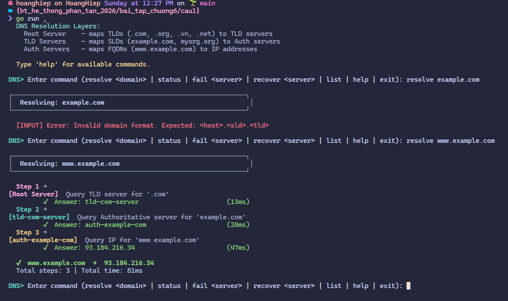
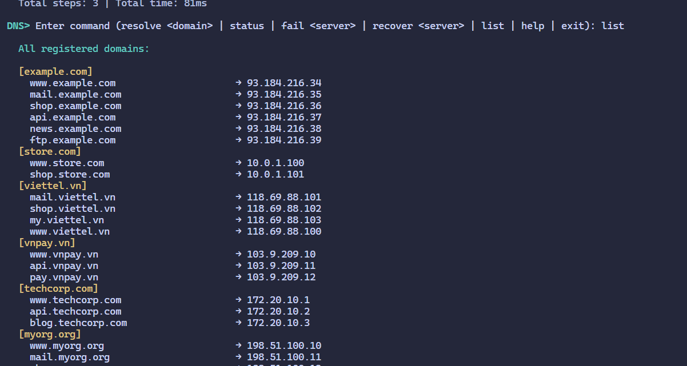
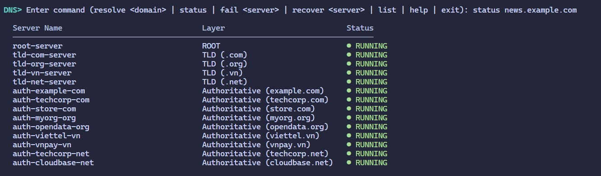

b. 
- Fail:
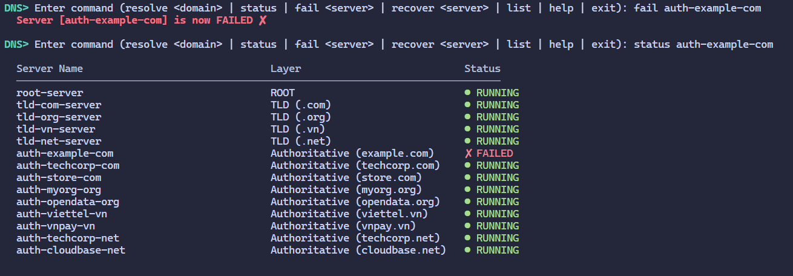
- Recover:
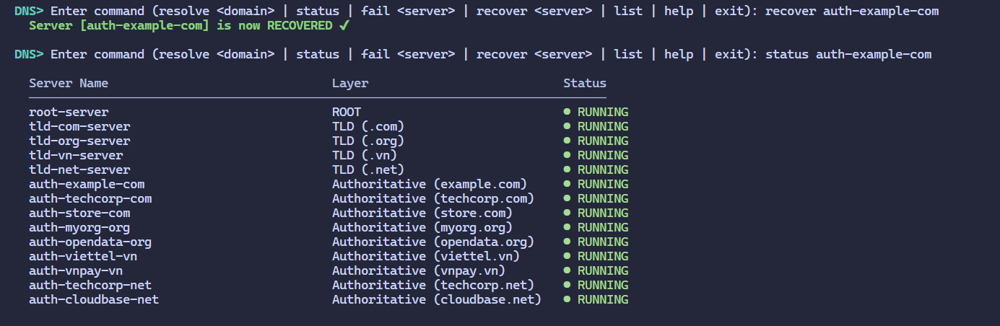

c.   
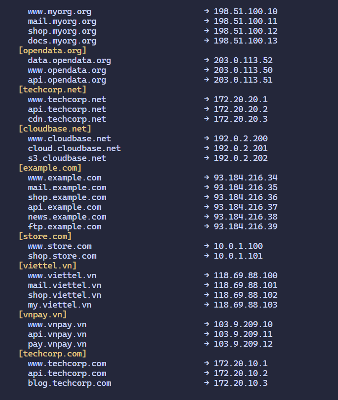
d. Thời gian truy vấn: (ĐÃ có ở từng ảnh)

## Bài tập 2:
a. 
- Cache hit
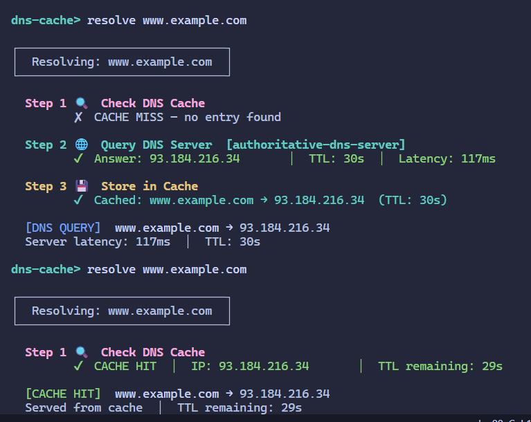
- TTL
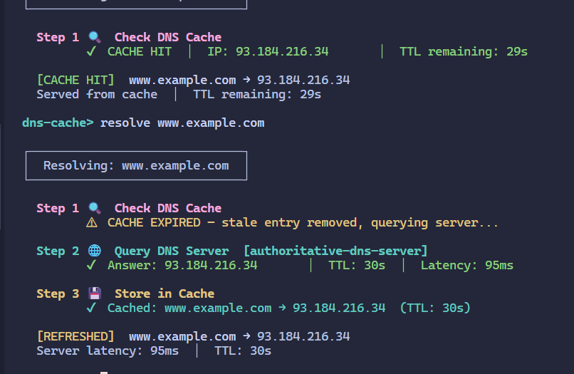

b. LRU eviction
```
// test commands (copy paste all)
batch www.example.com mail.example.com shop.example.com api.example.com news.example.com
cache
resolve ftp.example.com
cache
stats
```
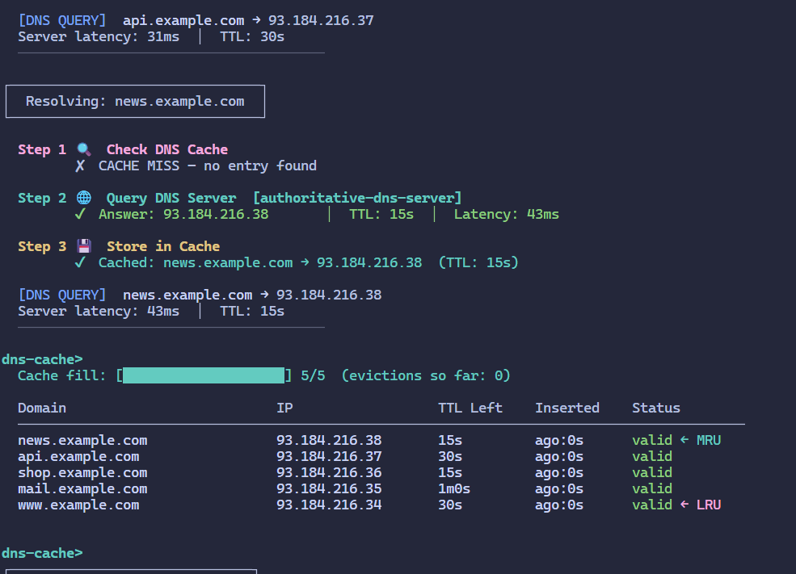
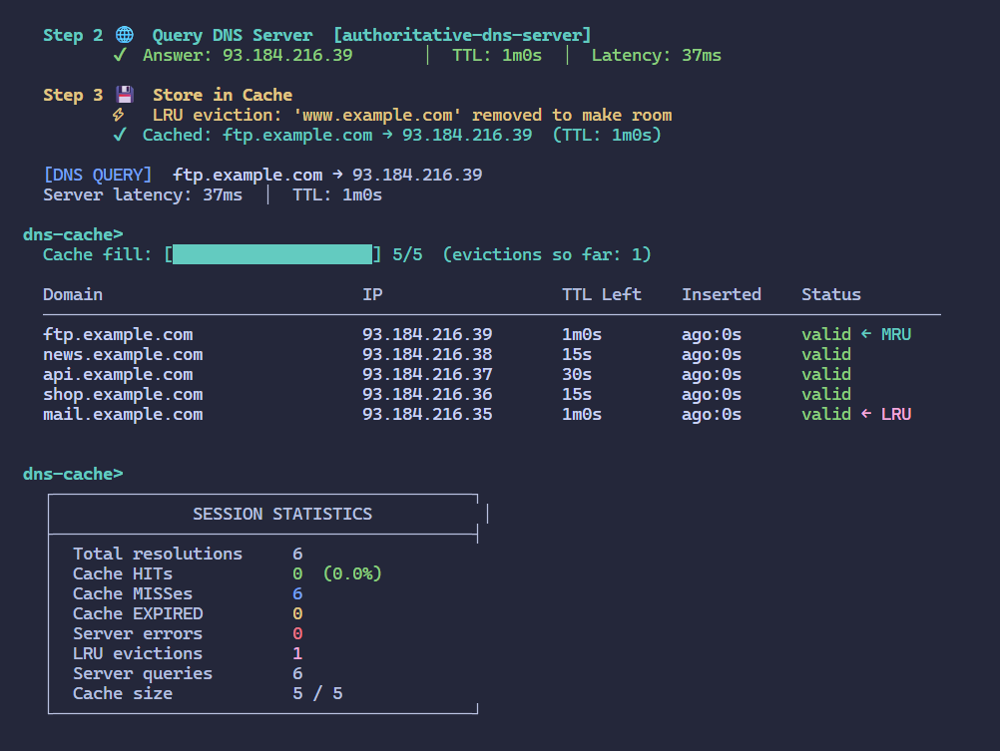

- Ở lần cache thứ nhất: cache đầy 5/5, www.example.com đang ở vị trí LRU.
- Ở lệnh resolve ftp.example.com: LRU eviction: 'www.example.com' removed to make room.
- Ở lần cache thứ hai: ftp.example.com đã vào vị trí MRU, và eviction tăng lên 1.
- Ở lệnh stats cuối cùng: bảng thống kê có số lượng LRU Eviction.

c. 
```
batch www.viettel.vn mail.viettel.vn shop.viettel.vn
cache
cache flush mail.viettel.vn
cache
cache flush
cache
```
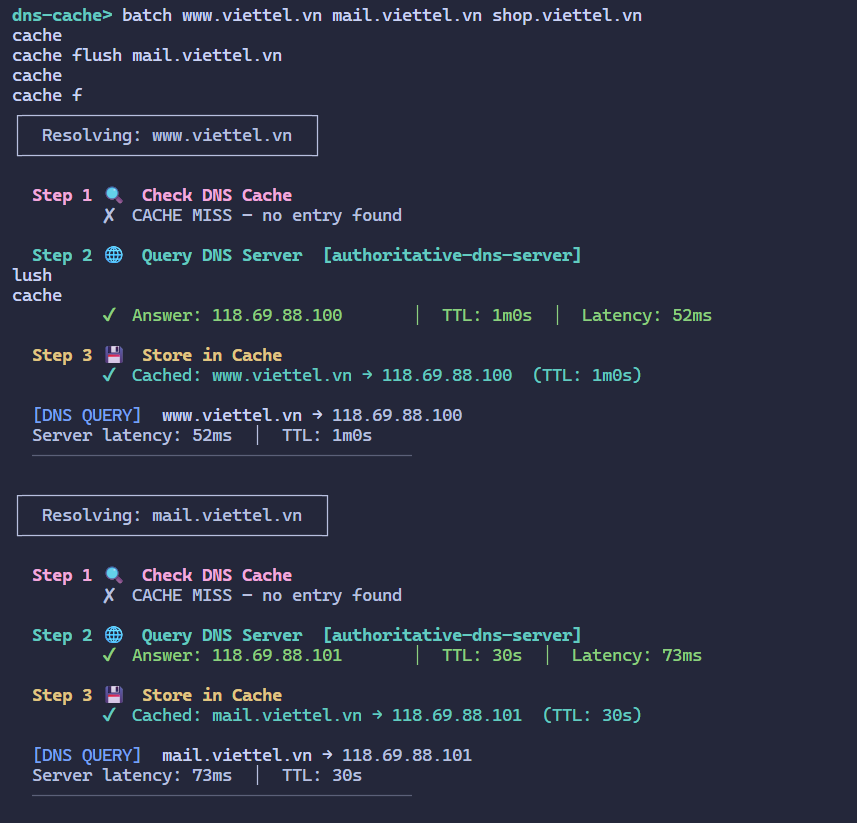
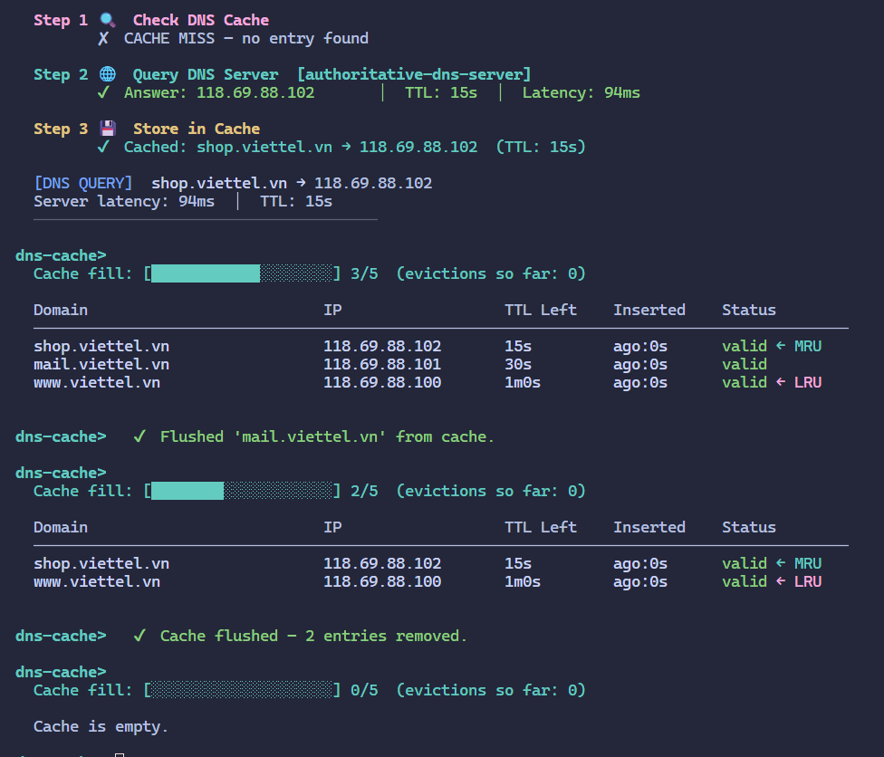

- Lệnh `cache flush <domain>` xóa duy nhất một bản ghi cụ thể.
- Lệnh `cache flush` xóa toàn bộ cache. Bảng in ra sẽ hiển thị `Cache is empty.`

d. 
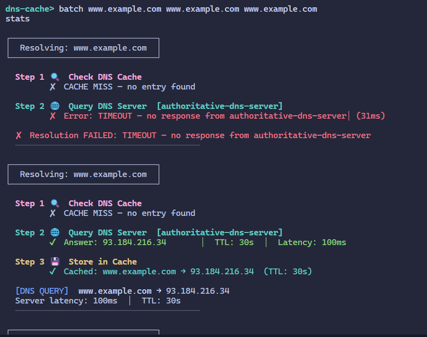
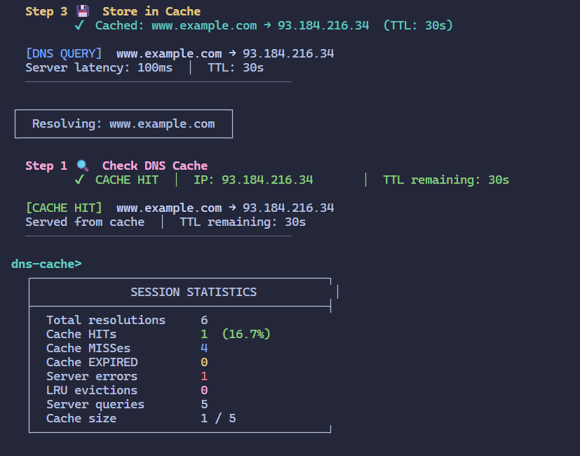
- Lệnh `stats` hiển thị rõ số lần Cache HIT, Cache MISS, và tính toán tỷ lệ Hit Rate.
- Số Server queries bằng số Cache MISS, chứng tỏ các lần Cache HIT không hề tốn tài nguyên truy vấn ra máy chủ thật.

e. Menu
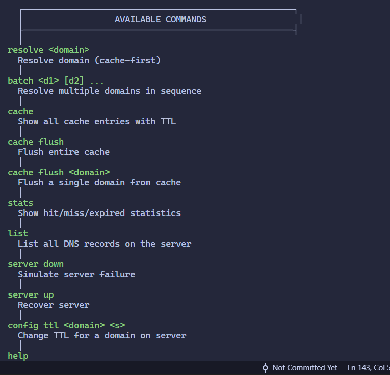